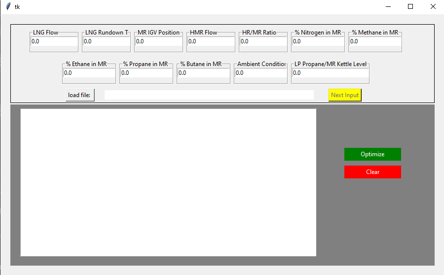

This project aims to apply Data analytics / Machine learning to optimizing the production of liquefied Natural gas from an existing plant.

Real Industrial data with about 70,000 records of activities in the plant was analyzed to build a model that predicts the LNG flow.

Then, an algorithm was created to interact with the model, using a form of binary search technique to find the best input variables that can optimize a particular state in the plant.

With the model, we were able to achieve an average of 10% increase in the optimization of the LNG production.

A Graphic user interface was designed to give a visual interaction with the work that has been done.

This work was done in an anaconda environment.

To use the app:
Run

```
python gui.py
```




